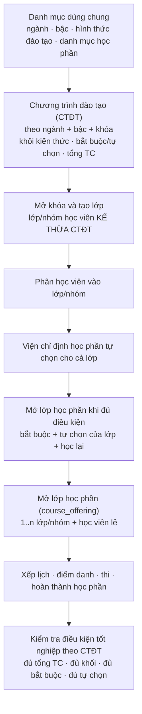

# Kế hoạch đào tạo & "gói học phần" — Phân tích và luồng nghiệp vụ chuẩn

Tài liệu này phân tích nghiệp vụ hiện có trong hệ thống quản lý đào tạo sau đại học
(Viện Đào tạo Sau đại học — Trường Đại học Hàng hải Việt Nam), chỉ ra các điểm
**chưa đúng với nghiệp vụ thực tế**, và đề xuất luồng nghiệp vụ chuẩn khớp với mô
hình dữ liệu hiện tại của dự án.

---

## 1. Hiện trạng trong hệ thống

### 1.1. Các bảng đang liên quan

| Bảng | Vai trò hiện tại |
| --- | --- |
| `subjects` | Danh mục học phần **theo từng chuyên ngành** (`major_id` + `program`), có `code_number`, `code_text`, `credits`, `subject_type` (CS/CN/TC/CH), `is_required`, `major_assignment`, `canonical_subject_id`, `allow_cross_major` |
| `class_groups` | Gọi là "nhóm học phần", thực chất là **lớp/nhóm học viên** theo `program` + `major_id` + `academic_year` (mã kiểu `THS-K32-N01` = Thạc sĩ · Khóa 32 · Nhóm 1) |
| `class_group_members` | Phân học viên (`admission_record_id`) vào lớp/nhóm |
| `subject_packages` | **Gói học phần gắn vào một lớp** (`class_group_id`), có `is_official`, `total_subjects` (mặc định 21) |
| `subject_package_subjects` | Danh sách học phần của gói |
| `course_offerings` | **Lớp học phần** được mở, gắn 1..n lớp/nhóm + học viên học lại |
| `training_programs` | "Chương trình đào tạo" nhưng **chỉ là metadata** (bậc + hình thức + ngành + thời lượng), **không có danh mục học phần** |

### 1.2. Luồng hiện tại

```text
Ngành (majors)
  └── Danh mục học phần của ngành (subjects, ~30 môn)
        └── Lớp/nhóm học viên (class_groups)
              └── Gói học phần (subject_packages)  ← gắn ở cấp LỚP
                    ├── is_official = true/false  (tối đa 1 gói chính thức / lớp)
                    └── ≤ 21 học phần (subject_package_subjects)
```

- `PlanService.createDefaultPackages()` tạo **2 gói cho mỗi lớp**: `G1-<lớp>` (chính thức) và
  `G2-<lớp>`, **cùng lấy 21 học phần đầu tiên** của chuyên ngành → hai gói giống hệt nhau.
- `SchedulingService.createCourseOffering()` **chặn mở lớp học phần** nếu học phần không
  nằm trong **gói chính thức** của lớp/nhóm.
- Ràng buộc DB: `subject_packages_one_official_per_class` (mỗi lớp chỉ 1 gói chính thức),
  `subject_packages_class_code_unique`.

### 1.3. Các điểm chưa đúng với nghiệp vụ

| # | Vấn đề | Bằng chứng | Hệ quả |
| --- | --- | --- | --- |
| 1 | **Sai cấp gắn kết**: gói học phần thuộc về *từng nhóm học viên* | `subject_packages.class_group_id` | Hai nhóm `N01`/`N02` cùng ngành + cùng khóa bị tách thành hai danh mục học phần riêng, dù bắt buộc học cùng một chương trình |
| 2 | **Trùng lặp vô nghĩa**: `G1` và `G2` giống hệt nhau | `createDefaultPackages()` cùng lấy `limit: 21` trên một danh sách | Dữ liệu rác; người dùng phải "chọn 1 trong 2 gói giống nhau" |
| 3 | **"1 gói chính thức / lớp" là quy tắc sai** | unique index `subject_packages_one_official_per_class` | Ép cả lớp chỉ có *một* danh sách học phần → **không mô hình hóa được học phần tự chọn theo từng học viên** và không có nhiều **định hướng** |
| 4 | **Giới hạn "21 học phần" là quy tắc bịa** | `ArrayMaxSize(21)`, `@Default(21)`, hardcode `21` ở UI | Ràng buộc thật là **tổng tín chỉ của CTĐT** (thạc sĩ 60 TC) và **cơ cấu khối kiến thức**, không phải số môn |
| 5 | **Thiếu cấu trúc khối kiến thức của CTĐT** | `subjects` chỉ có `subject_type` và `is_required` rời rạc | Không biểu diễn được: khối kiến thức chung / cơ sở ngành / chuyên ngành / luận văn; số TC tối thiểu phải chọn; học kỳ dự kiến; điều kiện tiên quyết; tổng TC |
| 6 | **Học phần dùng chung liên ngành mô hình hóa sai** | `canonical_subject_id` + `allow_cross_major` tạo bản ghi *alias* cho **từng ngành** | Triết học / Ngoại ngữ / Phương pháp NCKH bị nhân bản thành nhiều bản ghi cho nhiều ngành thay vì **một học phần dùng chung** |
| 7 | **Dùng "gói" như danh sách trắng để xếp lịch** | `createCourseOffering()` ném lỗi nếu môn không thuộc gói chính thức | Điều kiện đúng phải là: môn **thuộc CTĐT của ngành + khóa** và **đến kỳ mở**, không phụ thuộc một gói do người dùng tick tay |
| 8 | **Thiếu trục "đợt / học kỳ"** | Migration 029 đã bỏ `semester` (training_plans) và `term` (class_groups) | Không có chỗ để lập **kế hoạch mở học phần theo đợt** — trong khi thực tế Viện tổ chức theo *đợt* (Ví dụ: "Thông tin tuyển sinh đợt 2 năm 2026", "Công văn mở lớp học phần … đợt 2 năm 2026") |

---

## 2. Căn cứ nghiệp vụ

### 2.1. Quy chế đào tạo

- **Thông tư 23/2021/TT-BGDĐT** — Quy chế tuyển sinh và đào tạo trình độ **thạc sĩ**:
  chương trình đào tạo có khối lượng **60 tín chỉ**, cấu trúc theo các **khối kiến thức**:
  - Khối kiến thức chung (bắt buộc): triết học, ngoại ngữ;
  - Khối kiến thức cơ sở ngành: học phần bắt buộc và tự chọn;
  - Khối kiến thức chuyên ngành: học phần bắt buộc và tự chọn;
  - **Luận văn thạc sĩ** (định hướng nghiên cứu) hoặc **đề án tốt nghiệp** (định hướng ứng dụng).
- **Thông tư 18/2021/TT-BGDĐT** — Quy chế tuyển sinh và đào tạo trình độ **tiến sĩ**:
  chương trình gồm học phần bổ sung (triết học, ngoại ngữ), **chuyên đề tiến sĩ**,
  **tiểu luận tổng quan** và **luận án tiến sĩ**. Nghiên cứu sinh học theo đề cương cá nhân.
- **Học phần bổ sung kiến thức** cho người có bằng đại học chưa phù hợp: **không tính**
  vào khối lượng tín chỉ của CTĐT. Dự án đã có sẵn: `bridge_knowledge_subjects`,
  `masters_bridge_courses`.

> Số tín chỉ cụ thể của từng khối do **CTĐT của từng ngành** quy định; ràng buộc bất biến
> chỉ là **tổng tín chỉ** và **cơ cấu khối/bắt buộc–tự chọn**.

### 2.2. Thực tế tổ chức của Viện

```text
Ngành / chuyên ngành  →  CTĐT (theo ngành + bậc, áp dụng cho từng khóa)
Khóa (cohort)         →  Lớp / nhóm học viên (chỉ là đơn vị quản lý & xếp thời khóa biểu)
Học phần tự chọn      →  Viện chỉ định cho cả lớp (mọi học viên học chung danh sách)
Mở lớp học phần       →  Khi đủ điều kiện, không ràng buộc theo học kỳ / đợt
```

Bốn điểm mấu chốt (đã chốt với Viện):

1. **CTĐT thuộc về ngành + bậc + khóa**, không thuộc về lớp/nhóm. Chia nhóm chỉ để
   quản lý và xếp lịch; **không được làm thay đổi danh mục học phần**.
2. **Mỗi ngành + khóa chỉ có một CTĐT duy nhất** — Viện không tổ chức nhiều
   định hướng/phương án song song cho cùng một ngành và khóa.
3. **Học phần tự chọn do Viện chỉ định cho cả lớp**: mọi học viên trong lớp học chung
   một danh sách tự chọn, không đăng ký riêng từng người.
4. **Không dùng đơn vị học kỳ/đợt**: một học phần có thể được tổ chức bất kỳ lúc nào
   khi học viên đủ điều kiện, nên không cần trục thời gian ở cấp kế hoạch đào tạo.

Do đó, đơn vị "gói học phần theo lớp" là **không cần thiết**: danh mục học phần của lớp
được suy ra trực tiếp từ CTĐT của ngành + khóa, cộng với danh sách tự chọn mà Viện chọn cho lớp.

---

## 3. Luồng nghiệp vụ chuẩn (đề xuất)

### 3.1. Sơ đồ tổng thể



### 3.2. Chi tiết từng bước

| Bước | Việc làm | Ai làm | Dữ liệu |
| --- | --- | --- | --- |
| 1 | Lập **danh mục học phần** dùng chung (kể cả môn chung nhiều ngành: triết học, ngoại ngữ, phương pháp NCKH) | Viện / chuyên viên | `subjects` |
| 2 | Lập **CTĐT** cho từng ngành + bậc, áp dụng từ một khóa: chọn các **khối kiến thức**, khai báo học phần **bắt buộc / tự chọn**, **số TC tối thiểu phải chọn**, **tổng TC** | Hội đồng / Viện | `curriculums`, `curriculum_blocks`, `curriculum_elective_groups`, `curriculum_subjects` |
| 3 | **Mở khóa**: tạo lớp/nhóm học viên theo ngành + khóa. Lớp **kế thừa CTĐT** — không chọn tay danh sách môn | Viện | `class_groups.curriculum_id` |
| 4 | **Phân học viên** vào lớp/nhóm (thủ công hoặc chia đều) | Viện | `class_group_members` |
| 5 | **Chọn học phần tự chọn cho cả lớp** trong các nhóm tự chọn của CTĐT | Viện | `class_group_electives` |
| 6 | **Mở lớp học phần** cho các học phần bắt buộc và tự chọn đã chốt của lớp, kèm học viên học lại / bổ sung kiến thức | Viện | `course_offerings` |
| 7 | **Mở lớp học phần** cho 1..n lớp/nhóm + học viên lẻ (môn chung có thể ghép nhiều ngành) | Viện / người phụ trách xếp lịch | `course_offerings`, `course_offering_class_groups`, `course_offering_students` |
| 8 | **Xếp lịch – dạy – điểm danh – thi – hoàn thành học phần** | Giảng viên / Viện | `teaching_sessions`, `exam_sessions`, `exam_results` |
| 9 | **Kiểm tra điều kiện tốt nghiệp** theo CTĐT: đủ tổng TC, đủ từng khối, đủ bắt buộc, đủ tự chọn | Viện | tổng hợp |

---

## 4. Mô hình dữ liệu (đã triển khai)

### 4.1. Trạng thái hiện tại

```text
majors ──< curriculums ──< curriculum_blocks ──< curriculum_subjects >── subjects
   │              │
   │              └──< curriculum_elective_groups ──< curriculum_subjects
   │
   └──< class_groups ──< class_group_members >── admission_records
              │                    │
              │                    └──< course_offering_students
              ├──< class_group_electives >── curriculum_subjects
              └──< course_offering_class_groups >── course_offerings ──< teaching_sessions
```

| Bảng | Trạng thái | Ghi chú |
| --- | --- | --- |
| `subjects` | Giữ | Danh mục học phần theo ngành + bậc. `subject_type` (CS/CN/TC/CH) quyết định khối mặc định; `is_required` quyết định bắt buộc/tự chọn. |
| `curriculums` | **Mới** | CTĐT của một ngành + bậc + khóa (`applicable_from_year`). Ràng buộc duy nhất: `(major_id, program, applicable_from_year)`. |
| `curriculum_blocks` | **Mới** | Khối kiến thức (CS / CN / TC / CH) kèm `min_credits`. |
| `curriculum_elective_groups` | **Mới** | Nhóm tự chọn kèm `min_credits` / `max_credits`. |
| `curriculum_subjects` | **Mới** | Học phần trong CTĐT: `block_id`, `elective_group_id`, `is_required`, `credits`, `sort_order`. |
| `class_groups.curriculum_id` | **Mới** | Lớp kế thừa CTĐT của ngành + khóa; tự gán khi tạo/sửa lớp. |
| `class_group_electives` | **Mới** | Học phần **tự chọn mà Viện chỉ định cho cả lớp**. |
| `subject_packages`, `subject_package_subjects` | **Đã xóa** | Mô hình "gói học phần theo lớp" bị thay thế. |
| `teaching_periods`, `offering_plans`, `student_elective_registrations` | **Không tạo** | Viện không dùng học kỳ/đợt riêng; học phần tự chọn do Viện chỉ định cho lớp chứ không theo từng học viên. |

### 4.2. Quy tắc kiểm tra đã thực thi

1. **Toàn vẹn CTĐT**: `curriculums.total_credits` = tổng tín chỉ học phần bắt buộc + tổng `min_credits` của các nhóm tự chọn.
2. **Một CTĐT cho mỗi ngành + bậc + khóa**: tạo trùng trả về lỗi `ConflictException`.
3. **Lớp kế thừa CTĐT**: `ClassGroupService.create/update` tự gán `curriculum_id`; đổi ngành/bậc/khóa thì gán lại. CTĐT chưa tồn tại sẽ được tạo tự động từ danh mục học phần của ngành.
4. **Xóa CTĐT**: bị chặn khi còn lớp đang dùng.
5. **Học phần tự chọn**: phải thuộc CTĐT của lớp, phải là học phần tự chọn (không phải bắt buộc), và phải thỏa `min_credits`/`max_credits` của nhóm tự chọn.
6. **Danh mục học phần hiệu lực của lớp** = học phần bắt buộc trong CTĐT ∪ học phần tự chọn đã chỉ định. Đây là cơ sở để mở lớp học phần.
7. **Không còn giới hạn "21 học phần"**: ràng buộc là cơ cấu khối + tổng tín chỉ.
8. **Xóa học phần**: bị chặn khi học phần đang nằm trong CTĐT.

---

## 5. Trạng thái triển khai

| Hạng mục | Trạng thái |
| --- | --- |
| Migration `030-curriculum` (tạo bảng + chuyển dữ liệu + xóa bảng gói học phần) | ✅ Đã chạy trên database development |
| Model `Curriculum`, `CurriculumBlock`, `CurriculumElectiveGroup`, `CurriculumSubject`, `ClassGroupElective` | ✅ |
| `CurriculumService` (CRUD CTĐT, gán CTĐT cho lớp, chọn tự chọn cho lớp, danh mục hiệu lực) | ✅ |
| API `/plan/curriculums*`, `/plan/classes/:id/subjects`, `/plan/classes/:id/electives`, `/plan/classes/:id/curriculum` | ✅ |
| `ClassGroupService` tự gán CTĐT; `SchedulingService` kiểm tra theo CTĐT hiệu lực | ✅ |
| UI tab 2 `trainingPlan.jsx` (bảng CTĐT của lớp + chọn tự chọn) | ✅ |
| Seeds `seed-demo`, `bulk-fixtures`, `scheduling-test-fixture` | ✅ |
| Test unit backend + frontend | ✅ |

---

## 6. Việc còn lại (không thuộc phạm vi GĐ1 + GĐ2)

1. **UI nhập CTĐT chuyên sâu**: hiện UI chỉ hiển thị CTĐT mà lớp kế thừa và cho chọn học phần tự chọn. Việc khai báo **khối kiến thức, nhóm tự chọn, số tín chỉ tối thiểu** và gán học phần vào CTĐT đang dùng API `/plan/curriculums` (chưa có màn hình riêng).
2. **Học phần dùng chung liên ngành**: `subjects.canonical_subject_id` + `allow_cross_major` vẫn giữ cách mô hình hóa "bản ghi tương ứng theo ngành". Có thể thay bằng bảng nối `subject_majors` ở giai đoạn sau.
3. **Điều kiện tiên quyết & tiến độ học kỳ**: chưa cần vì Viện không tổ chức theo học kỳ/đợt.
4. **`seed-demo`**: phần dọn dữ liệu demo cũ xóa `class_groups` trực tiếp nên sẽ lỗi nếu các lớp demo đã được dùng để mở lớp học phần qua giao diện (ràng buộc `course_offering_class_groups`). Đây là hạn chế có từ trước, cần dọn thêm `course_offerings`/`teaching_sessions` nếu muốn chạy lại seed trên database đã thao tác.

