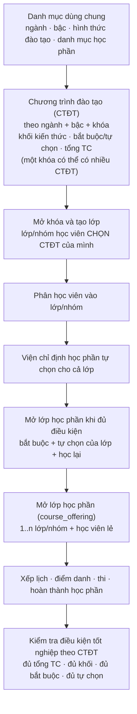

# Kế hoạch đào tạo & "gói học phần" — Phân tích và luồng nghiệp vụ chuẩn

Tài liệu này phân tích nghiệp vụ hiện có trong hệ thống quản lý đào tạo sau đại học
(Viện Đào tạo Sau đại học — Trường Đại học Hàng hải Việt Nam), chỉ ra các điểm
**chưa đúng với nghiệp vụ thực tế**, và đề xuất luồng nghiệp vụ chuẩn khớp với mô
hình dữ liệu hiện tại của dự án.

---

## 1. Hiện trạng trong hệ thống

### 1.1. Các bảng đang liên quan

| Bảng | Vai trò hiện tại |
| --- | --- |
| `subjects` | Danh mục học phần **theo từng chuyên ngành** (`major_id` + `program`), có `code_number`, `code_text`, `credits`, `subject_type` (CS/CN/TC/CH), `is_required`, `major_assignment`, `canonical_subject_id`, `allow_cross_major` |
| `class_groups` | Gọi là "nhóm học phần", thực chất là **lớp/nhóm học viên** theo `program` + `major_id` + `academic_year` (mã kiểu `THS-K32-N01` = Thạc sĩ · Khóa 32 · Nhóm 1) |
| `class_group_members` | Phân học viên (`admission_record_id`) vào lớp/nhóm |
| `subject_packages` | **Gói học phần gắn vào một lớp** (`class_group_id`), có `is_official`, `total_subjects` (mặc định 21) |
| `subject_package_subjects` | Danh sách học phần của gói |
| `course_offerings` | **Lớp học phần** được mở, gắn 1..n lớp/nhóm + học viên học lại |
| `training_programs` | "Chương trình đào tạo" nhưng **chỉ là metadata** (bậc + hình thức + ngành + thời lượng), **không có danh mục học phần** |

### 1.2. Luồng hiện tại

```text
Ngành (majors)
  └── Danh mục học phần của ngành (subjects, ~30 môn)
        └── Lớp/nhóm học viên (class_groups)
              └── Gói học phần (subject_packages)  ← gắn ở cấp LỚP
                    ├── is_official = true/false  (tối đa 1 gói chính thức / lớp)
                    └── ≤ 21 học phần (subject_package_subjects)
```

- `PlanService.createDefaultPackages()` tạo **2 gói cho mỗi lớp**: `G1-<lớp>` (chính thức) và
  `G2-<lớp>`, **cùng lấy 21 học phần đầu tiên** của chuyên ngành → hai gói giống hệt nhau.
- `SchedulingService.createCourseOffering()` **chặn mở lớp học phần** nếu học phần không
  nằm trong **gói chính thức** của lớp/nhóm.
- Ràng buộc DB: `subject_packages_one_official_per_class` (mỗi lớp chỉ 1 gói chính thức),
  `subject_packages_class_code_unique`.

### 1.3. Các điểm chưa đúng với nghiệp vụ

| # | Vấn đề | Bằng chứng | Hệ quả |
| --- | --- | --- | --- |
| 1 | **Sai cấp gắn kết**: gói học phần thuộc về *từng nhóm học viên* | `subject_packages.class_group_id` | Hai nhóm `N01`/`N02` cùng ngành + cùng khóa bị tách thành hai danh mục học phần riêng, dù bắt buộc học cùng một chương trình |
| 2 | **Trùng lặp vô nghĩa**: `G1` và `G2` giống hệt nhau | `createDefaultPackages()` cùng lấy `limit: 21` trên một danh sách | Dữ liệu rác; người dùng phải "chọn 1 trong 2 gói giống nhau" |
| 3 | **"1 gói chính thức / lớp" là quy tắc sai** | unique index `subject_packages_one_official_per_class` | Ép cả lớp chỉ có *một* danh sách học phần → **không mô hình hóa được học phần tự chọn theo từng học viên** và không có nhiều **định hướng** |
| 4 | **Giới hạn "21 học phần" là quy tắc bịa** | `ArrayMaxSize(21)`, `@Default(21)`, hardcode `21` ở UI | Ràng buộc thật là **tổng tín chỉ của CTĐT** (thạc sĩ 60 TC) và **cơ cấu khối kiến thức**, không phải số môn |
| 5 | **Thiếu cấu trúc khối kiến thức của CTĐT** | `subjects` chỉ có `subject_type` và `is_required` rời rạc | Không biểu diễn được: khối kiến thức chung / cơ sở ngành / chuyên ngành / luận văn; số TC tối thiểu phải chọn; học kỳ dự kiến; điều kiện tiên quyết; tổng TC |
| 6 | **Học phần học chung liên ngành từng bị mô hình hóa sai** | Một bản ghi/mã cấp Viện được gắn vào CTĐT của nhiều ngành | Thực tế mỗi ngành có mã học phần riêng; quan hệ học chung chỉ phục vụ ghép lớp giữa các bản ghi cùng tên và số tín chỉ |
| 7 | **Dùng "gói" như danh sách trắng để xếp lịch** | `createCourseOffering()` ném lỗi nếu môn không thuộc gói chính thức | Điều kiện đúng phải là: môn **thuộc CTĐT của ngành + khóa** và **đến kỳ mở**, không phụ thuộc một gói do người dùng tick tay |
| 8 | **Thiếu trục "đợt / học kỳ"** | Migration 029 đã bỏ `semester` (training_plans) và `term` (class_groups) | Không có chỗ để lập **kế hoạch mở học phần theo đợt** — trong khi thực tế Viện tổ chức theo *đợt* (Ví dụ: "Thông tin tuyển sinh đợt 2 năm 2026", "Công văn mở lớp học phần … đợt 2 năm 2026") |

---

## 2. Căn cứ nghiệp vụ

### 2.1. Quy chế đào tạo

- **Thông tư 23/2021/TT-BGDĐT** — Quy chế tuyển sinh và đào tạo trình độ **thạc sĩ**:
  chương trình đào tạo có khối lượng **60 tín chỉ**, cấu trúc theo các **khối kiến thức**:
  - Khối kiến thức chung (bắt buộc): triết học, ngoại ngữ;
  - Khối kiến thức cơ sở ngành: học phần bắt buộc và tự chọn;
  - Khối kiến thức chuyên ngành: học phần bắt buộc và tự chọn;
  - **Luận văn thạc sĩ** (định hướng nghiên cứu) hoặc **đề án tốt nghiệp** (định hướng ứng dụng).
- **Thông tư 18/2021/TT-BGDĐT** — Quy chế tuyển sinh và đào tạo trình độ **tiến sĩ**:
  chương trình gồm học phần bổ sung (triết học, ngoại ngữ), **chuyên đề tiến sĩ**,
  **tiểu luận tổng quan** và **luận án tiến sĩ**. Nghiên cứu sinh học theo đề cương cá nhân.
- **Học phần bổ sung kiến thức** cho người có bằng đại học chưa phù hợp: **không tính**
  vào khối lượng tín chỉ của CTĐT. Dự án đã có sẵn: `bridge_knowledge_subjects`,
  `masters_bridge_courses`.

> Số tín chỉ cụ thể của từng khối do **CTĐT của từng ngành** quy định; ràng buộc bất biến
> chỉ là **tổng tín chỉ** và **cơ cấu khối/bắt buộc–tự chọn**.

### 2.2. Thực tế tổ chức của Viện

```text
Ngành / chuyên ngành  →  CTĐT (theo ngành + bậc, áp dụng cho từng khóa; một khóa có thể có nhiều CTĐT)
Khóa (cohort)         →  Lớp / nhóm học viên (chỉ là đơn vị quản lý & xếp thời khóa biểu)
Lớp / nhóm học viên   →  Chọn CTĐT mà lớp theo học (class_groups.curriculum_id)
Học phần tự chọn      →  Viện chỉ định cho cả lớp (mọi học viên học chung danh sách)
Mở lớp học phần       →  Khi đủ điều kiện, không ràng buộc theo học kỳ / đợt
```

Bốn điểm mấu chốt (đã chốt với Viện):

1. **CTĐT thuộc về ngành + bậc + khóa**, không thuộc về lớp/nhóm. Chia nhóm chỉ để
   quản lý và xếp lịch; **không được làm thay đổi danh mục học phần**.
2. **Một ngành + bậc + khóa có thể có nhiều CTĐT**, và **mỗi lớp tự chọn CTĐT mà lớp đó
   theo học** qua `class_groups.curriculum_id`. Việc chọn này là bắt buộc khi tồn tại nhiều
   CTĐT trong cùng phạm vi, để hai nhóm cùng ngành + khóa vẫn có thể học hai chương trình khác nhau.
3. **Học phần tự chọn do Viện chỉ định cho cả lớp**: mọi học viên trong lớp học chung
   một danh sách tự chọn, không đăng ký riêng từng người.
4. **Không dùng đơn vị học kỳ/đợt**: một học phần có thể được tổ chức bất kỳ lúc nào
   khi học viên đủ điều kiện, nên không cần trục thời gian ở cấp kế hoạch đào tạo.

Do đó, đơn vị "gói học phần theo lớp" là **không cần thiết**: danh mục học phần của lớp
được suy ra trực tiếp từ **CTĐT mà lớp đã chọn** trong phạm vi ngành + bậc + khóa, cộng
với danh sách tự chọn mà Viện chọn cho lớp.

---

## 3. Luồng nghiệp vụ chuẩn (đề xuất)

### 3.1. Sơ đồ tổng thể


```mermaid
flowchart TD
  A["Danh mục dùng chung<br/>ngành · bậc · hình thức đào tạo · danh mục học phần"]
  B["Chương trình đào tạo (CTĐT)<br/>theo ngành + bậc + khóa<br/>khối kiến thức · bắt buộc/tự chọn · tổng TC<br/>(một khóa có thể có nhiều CTĐT)"]
  C["Mở khóa và tạo lớp<br/>lớp/nhóm học viên CHỌN CTĐT của mình"]
  D["Phân học viên vào lớp/nhóm"]
  E["Viện chỉ định học phần tự chọn cho cả lớp"]
  F["Mở lớp học phần khi đủ điều kiện<br/>bắt buộc + tự chọn của lớp + học lại"]
  G["Mở lớp học phần (course_offering)<br/>1..n lớp/nhóm + học viên lẻ"]
  H["Xếp lịch · điểm danh · thi · hoàn thành học phần"]
  I["Kiểm tra điều kiện tốt nghiệp theo CTĐT<br/>đủ tổng TC · đủ khối · đủ bắt buộc · đủ tự chọn"]

  A --> B --> C --> D --> E --> F --> G --> H --> I
```

### 3.2. Chi tiết từng bước

| Bước | Việc làm | Ai làm | Dữ liệu |
| --- | --- | --- | --- |
| 1 | Lập **danh mục học phần** dùng chung (kể cả môn chung nhiều ngành: triết học, ngoại ngữ, phương pháp NCKH) | Viện / chuyên viên | `subjects` |
| 2 | Lập **CTĐT** cho từng ngành + bậc, áp dụng từ một khóa: chọn các **khối kiến thức**, khai báo học phần **bắt buộc / tự chọn**, **số TC tối thiểu phải chọn**, **tổng TC**. Một ngành + khóa có thể có nhiều CTĐT (mỗi CTĐT một mã riêng) | Hội đồng / Viện | `curriculums`, `curriculum_blocks`, `curriculum_elective_groups`, `curriculum_subjects` |
| 3 | **Mở khóa**: tạo lớp/nhóm học viên theo ngành + khóa. Mỗi lớp **chọn CTĐT** mà lớp theo học (bắt buộc chọn khi phạm vi có nhiều CTĐT) | Viện | `class_groups.curriculum_id` |
| 4 | **Phân học viên** vào lớp/nhóm (thủ công hoặc chia đều) | Viện | `class_group_members` |
| 5 | **Chọn học phần tự chọn cho cả lớp** trong các nhóm tự chọn của CTĐT | Viện | `class_group_electives` |
| 6 | **Mở lớp học phần** cho các học phần bắt buộc và tự chọn đã chốt của lớp, kèm học viên học lại / bổ sung kiến thức | Viện | `course_offerings` |
| 7 | **Mở lớp học phần** cho 1..n lớp/nhóm + học viên lẻ (môn chung có thể ghép nhiều ngành) | Viện / người phụ trách xếp lịch | `course_offerings`, `course_offering_class_groups`, `course_offering_students` |
| 8 | **Xếp lịch – dạy – điểm danh – thi – hoàn thành học phần** | Giảng viên / Viện | `teaching_sessions`, `exam_sessions`, `exam_results` |
| 9 | **Kiểm tra điều kiện tốt nghiệp** theo CTĐT: đủ tổng TC, đủ từng khối, đủ bắt buộc, đủ tự chọn | Viện | tổng hợp |

---

## 4. Mô hình dữ liệu (đã triển khai)

### 4.0. Danh mục hai cấp: Ngành (cấp 1) và Chuyên ngành (cấp 2)

Trước đây bảng `majors` vừa đóng vai *ngành* vừa đóng vai *chuyên ngành*, nên phải dùng
pseudo-major `CHUNG` để chứa học phần chung cấp Viện. Migration `042-disciplines` tách
thành hai cấp đúng nghiệp vụ:

```text
disciplines (Ngành — mã ngành BGD&ĐT)
  └──< majors (Chuyên ngành, majors.discipline_id)
            └──< subjects / curriculums / class_groups …
```

| Quy tắc | Nội dung |
| --- | --- |
| Quan hệ | Mỗi chuyên ngành thuộc **đúng một** ngành (`majors.discipline_id` NOT NULL). |
| Mã chuyên ngành | Chỉ duy nhất **trong phạm vi một ngành** (unique `discipline_id + code`), không còn unique toàn cục. |
| Bậc đào tạo | Vẫn thuộc **chuyên ngành**, nên cùng một ngành có thể có chuyên ngành Thạc sĩ và Tiến sĩ với mã khác nhau (ví dụ `KTHH` / `KHHH-TS`). |
| Chuyên ngành dùng chung | `CHUYEN-NGANH-CHUNG` (thuộc ngành `DUNG-CHUNG`) là chỗ chứa danh mục học phần kiến thức chung cấp Viện; bị loại khỏi mọi danh sách lựa chọn chuyên ngành (tuyển sinh, mở lớp, gán hồ sơ) bởi hằng số `COMMON_MAJOR_CODE`. |

UI: `Ngành đào tạo` (`/system/disciplines`) và `Chuyên ngành` (`/system/majors`, có cột
chọn ngành cha). API: `GET/POST/PUT/DELETE /system/disciplines`, `/system/majors`.

Giao diện liên quan tới CTĐT của lớp:

| Màn hình | Việc làm được |
| --- | --- |
| **Kế hoạch đào tạo** (`/plan/training-plan`), tab 2 | Xem CTĐT **nhóm theo từng khóa** (mỗi khóa một nhóm “KHÓA <năm>” kèm số CTĐT và số lớp), lập CTĐT mới, sửa học phần/khối, xóa CTĐT. Mã CTĐT tự gợi ý mã chưa trùng khi khóa đã có CTĐT. |
| **Tạo nhóm học viên** (`/masters/create-class-groups`) | **Chọn CTĐT cho từng lớp** (cột “Chương trình đào tạo”, nút Chỉnh sửa) và chọn CTĐT khi tạo lớp mới. |

### 4.1. Trạng thái hiện tại

```text
disciplines (Ngành)
  └── majors ──< curriculums ──< curriculum_blocks ──< curriculum_subjects >── subjects
         │              │
         │              ├──< curriculum_elective_groups ──< curriculum_subjects
         │              └──< class_groups (mỗi lớp chọn 1 CTĐT)
         │
         └──< class_groups ──< class_group_members >── admission_records
                    │                    │
                    │                    └──< course_offering_students
                    ├──< class_group_electives >── curriculum_subjects
                    └──< course_offering_class_groups >── course_offerings ──< teaching_sessions
```

| Bảng | Trạng thái | Ghi chú |
| --- | --- | --- |
| `disciplines` | **Mới** | Ngành (cấp 1), mã ngành BGD&ĐT. Một ngành có nhiều chuyên ngành. |
| `majors.discipline_id` | **Mới** | Chuyên ngành thuộc đúng một ngành; unique `(discipline_id, code)`. |
| `subjects` | Giữ | Danh mục học phần theo ngành + bậc. Kể cả học phần cùng tên giữa nhiều ngành cũng có bản ghi và mã riêng theo ngành; `shared_major_ids` xác định chính xác các ngành được phép ghép lớp theo tên + số tín chỉ. `subject_type` (KC/CS/CN/TC/CH) quyết định khối mặc định. |
| `curriculums` | **Mới** | CTĐT của một ngành + bậc + khóa (`applicable_from_year`). **Một khóa có thể có nhiều CTĐT**; chỉ số `(major_id, program, applicable_from_year)` là index thường, không unique. Mã CTĐT `code` mới là unique toàn cục. |
| `curriculum_blocks` | **Mới** | Khối kiến thức (CS / CN / TC / CH) kèm `min_credits`. |
| `curriculum_elective_groups` | **Mới** | Nhóm tự chọn kèm `min_credits` / `max_credits`. |
| `curriculum_subjects` | **Mới** | Học phần trong CTĐT: `block_id`, `elective_group_id`, `is_required`, `credits`, `sort_order`. |
| `class_groups.curriculum_id` | **Mới** | **Lớp chọn CTĐT mà lớp theo học**; tự gán khi tạo/sửa lớp. Nếu phạm vi ngành + bậc + khóa chỉ có một CTĐT thì gán ngầm; nếu có nhiều thì buộc chọn. |
| `class_group_electives` | **Mới** | Học phần **tự chọn mà Viện chỉ định cho cả lớp**. |
| `subject_packages`, `subject_package_subjects` | **Đã xóa** | Mô hình "gói học phần theo lớp" bị thay thế. |
| `teaching_periods`, `offering_plans`, `student_elective_registrations` | **Không tạo** | Viện không dùng học kỳ/đợt riêng; học phần tự chọn do Viện chỉ định cho lớp chứ không theo từng học viên. |

### 4.2. Quy tắc kiểm tra đã thực thi

1. **Toàn vẹn CTĐT**: `curriculums.total_credits` = tổng tín chỉ học phần bắt buộc + tổng `min_credits` của các nhóm tự chọn.
2. **Nhiều CTĐT cho một ngành + bậc + khóa**: được phép. Chỉ **mã CTĐT** (`code`) là unique toàn cục — tạo trùng mã trả về `ConflictException`.
3. **Lớp chọn CTĐT của mình**: `ClassGroupService.create/update` gán `curriculum_id` qua `CurriculumService.assignToClassGroup`; đổi ngành/bậc/khóa thì gán lại. Nếu lớp chưa chọn mà phạm vi có **nhiều** CTĐT thì trả lỗi buộc chọn; nếu có **đúng một** thì gán ngầm; nếu **chưa có** thì tự tạo từ danh mục học phần của ngành.
4. **Xóa CTĐT**: bị chặn khi còn lớp đang dùng.
5. **Học phần tự chọn**: phải thuộc CTĐT của lớp, phải là học phần tự chọn (không phải bắt buộc), và phải thỏa `min_credits`/`max_credits` của nhóm tự chọn.
6. **Danh mục học phần hiệu lực của lớp** = học phần bắt buộc trong CTĐT ∪ học phần tự chọn đã chỉ định. Đây là cơ sở để mở lớp học phần.
7. **Không còn giới hạn "21 học phần"**: ràng buộc là cơ cấu khối + tổng tín chỉ.
8. **Xóa học phần**: bị chặn khi học phần đang nằm trong CTĐT.

---

## 4A. Công nhận học phần dùng chung (chuyển ngành · tiền thạc sĩ · học trước)

Một cơ chế duy nhất, không có ba luồng công nhận riêng.

```text
admission_records ──< learner_subject_results ──> subjects
                             │                  └─> bridge_knowledge_subjects ──> subjects (equivalent_subject_id)
                             │
                             └──< subject_recognitions ──> subjects (nguồn) + subjects (đích CTĐT)
                                             └─ major_transfers (tùy chọn, có thể NULL)
```

### Kết quả học phần cá nhân — `learner_subject_results`

Mỗi lần học lưu: học viên, học phần (`subject_id` **hoặc** `bridge_knowledge_subject_id`),
lớp học phần, nguồn học (`pre_masters` · `early_enrollment` · `regular` · `external`),
điểm, trạng thái và kết quả. Ràng buộc CHECK buộc đúng một trong hai nguồn danh mục.

| Trạng thái | Kết quả | Ý nghĩa |
| --- | --- | --- |
| `registered` / `studying` | `pending` | Mới đăng ký hoặc đang học. **Chỉ kế thừa đăng ký, chưa tính tín chỉ.** |
| `completed` | `passed` / `exempt` | **Đủ điều kiện công nhận.** |
| `completed` | `failed` | Phải học lại, không công nhận. |

### Đối chiếu tự động — `SubjectRecognitionService.proposeForRecord()`

Khi học viên vào CTĐT chính thức (hoặc cập nhật một kết quả về `completed` + `passed`),
hệ thống đối chiếu toàn bộ kết quả với CTĐT hiện hành:

| Trường hợp | Kết quả |
| --- | --- |
| Cùng học phần gốc (`canonical_subject_id`) | **Tự động công nhận** — `basis = canonical_subject` |
| Khác mã nhưng đã khai báo tương đương | **Tự động công nhận** — `basis = declared_equivalence` |
| Chỉ trùng tên + số tín chỉ | **Chờ hội đồng xác nhận** — `basis = same_name`, `status = pending` |
| Học bổ sung kiến thức chưa khai báo tương đương | **Không công nhận** |

### Quy tắc sau khi duyệt

1. Quyết định công nhận **độc lập**, `major_transfer_id` có thể NULL nên dùng được cho cả tiền thạc sĩ và học trước.
2. Học phần đã công nhận (`status = approved`):
   - Không xếp học lại (chặn cả ở `listRetakes`/`registerRetake`).
   - Không đưa vào danh sách lớp học phần (loại khỏi roster và số lượng học viên).
   - Được tính tín chỉ hoàn thành (`GET /plan/admission-records/:id/recognized-credits`).
   - Vẫn giữ nguồn, điểm và lịch sử học trước qua `learning_result_id`.
3. Học phần mới đăng ký nhưng **chưa hoàn thành** vẫn được chuyển sang hồ sơ chính thức và tiếp tục học trong lớp đang đăng ký.

### Điểm nối dữ liệu

- Chuyển chuyên ngành (`major_transfers`) là **một trong các luồng gọi** engine này, không phải điều kiện bắt buộc.
- `syncRegularResults()` chuyển các lớp học phần đã hoàn thành giảng dạy mà học viên đã tham gia thành
  kết quả nguồn `regular`, nên engine chỉ đọc một nguồn dữ liệu duy nhất kể cả với dữ liệu cũ.
- Danh mục BSKT (`bridge_knowledge_subjects.equivalent_subject_id`) là nơi khai báo tương đương;
  khai báo này là điều kiện bắt buộc để công nhận học bổ sung kiến thức.

---

## 5. Trạng thái triển khai

| Hạng mục | Trạng thái |
| --- | --- |
| Migration `042-disciplines` (bảng ngành + `majors.discipline_id` + unique theo ngành) | ✅ Đã chạy trên database development |
| Danh mục hai cấp: UI `Ngành đào tạo` (`/system/disciplines`) và `Chuyên ngành` (`/system/majors`) | ✅ |
| API `/system/disciplines` (CRUD) và `/system/majors` (kèm ngành cha) | ✅ |
| Loại chuyên ngành dùng chung (`CHUYEN-NGANH-CHUNG`) khỏi tuyển sinh / mở lớp / gán hồ sơ | ✅ |
| Migration `030-curriculum` (tạo bảng + chuyển dữ liệu + xóa bảng gói học phần) | ✅ Đã chạy trên database development |
| Model `Curriculum`, `CurriculumBlock`, `CurriculumElectiveGroup`, `CurriculumSubject`, `ClassGroupElective` | ✅ |
| `CurriculumService` (CRUD CTĐT, gán CTĐT lớp đã chọn cho lớp, chọn tự chọn cho lớp, danh mục hiệu lực) | ✅ |
| API `/plan/curriculums*`, `/plan/classes/:id/subjects`, `/plan/classes/:id/electives`, `/plan/classes/:id/curriculum` | ✅ |
| `ClassGroupService` gán CTĐT lớp đã chọn; `SchedulingService` kiểm tra theo CTĐT hiệu lực | ✅ |
| `LearnerSubjectResult` + `SubjectRecognitionService` (công nhận dùng chung) | ✅ |
| API `/plan/admission-records/:id/learning-results`, `/plan/learning-results/:id`, `/plan/admission-records/:id/subject-recognitions`, `/plan/subject-recognitions/:id/decision` | ✅ |
| UI `admissionRecordDetail.jsx` (nhập kết quả học phần + duyệt công nhận), `bridgeKnowledge.jsx` (khai báo tương đương) | ✅ |
| UI tab 2 `trainingPlan.jsx` (bảng CTĐT của lớp + chọn tự chọn); `createClassGroups.jsx` cho **chọn CTĐT** khi phạm vi có nhiều CTĐT | ✅ |
| Seeds `seed-demo`, `bulk-fixtures`, `scheduling-test-fixture` | ✅ |
| Test unit backend + frontend | ✅ |

---

## 6. Việc còn lại (không thuộc phạm vi GĐ1 + GĐ2)

1. **UI nhập CTĐT chuyên sâu**: hiện UI hiển thị CTĐT mà lớp đã chọn và cho chọn học phần tự chọn. Việc khai báo **khối kiến thức, nhóm tự chọn, số tín chỉ tối thiểu** và gán học phần vào CTĐT đang dùng API `/plan/curriculums` (chưa có màn hình riêng).
2. **Học phần học chung liên ngành**: mỗi ngành giữ bản ghi và mã học phần riêng. `shared_major_ids` lưu phạm vi ngành được phép học chung; chức năng mở lớp chỉ ghép học phần cùng tên, cùng số tín chỉ, cùng bậc và thuộc phạm vi này. Mã học phần không được dùng làm khóa nhận diện liên ngành.
   Khi tạo mới, người dùng nhập thông tin học phần một lần, chọn phạm vi ngành và nhập mã riêng cho từng ngành; API tạo toàn bộ bản ghi trong cùng một transaction.
3. **Điều kiện tiên quyết & tiến độ học kỳ**: chưa cần vì Viện không tổ chức theo học kỳ/đợt.
4. **`seed-demo`**: phần dọn dữ liệu demo cũ xóa `class_groups` trực tiếp nên sẽ lỗi nếu các lớp demo đã được dùng để mở lớp học phần qua giao diện (ràng buộc `course_offering_class_groups`). Đây là hạn chế có từ trước, cần dọn thêm `course_offerings`/`teaching_sessions` nếu muốn chạy lại seed trên database đã thao tác.

